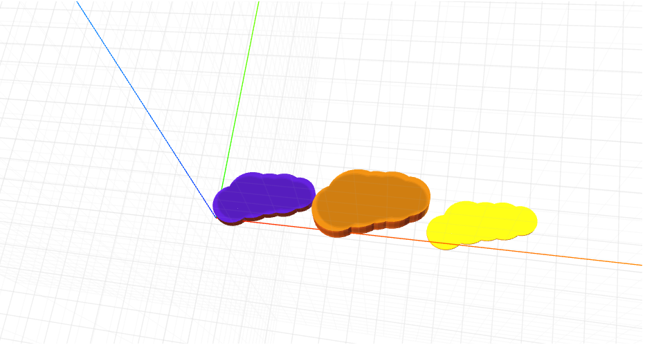

# craft-cloud
Parameterized cloud.

## Install:

    $ npm install craft-cloud

## Parameters:

**radius:** To adjust radius of each component of cloud

**height:** To adjust height of cloud

## Example:

    <craft>
        <craft name="cloud" module="craft-cloud"/>
           <cloud radius="2.5" height="1"></cloud>
           <cloud radius="3" height="2"></cloud>
          <cloud></cloud>
    </craft>

